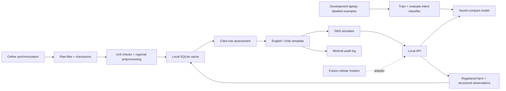

# FarmSignal

A local, reproducible research MVP for one question: **“Can I grow maize here, and what should I check?”**

Team: Joel, Usama Khan and Fahid. This implementation uses the supplied pitch as product context, not evidence of deployed capabilities.

## Run the demo

Python 3.12, Git and Make are required. Installation needs internet. The repository is private, so cloning requires an authorized GitHub account.

```sh
git clone https://github.com/itsusamakhan/farmsignal.git
cd farmsignal
```

Python 3.12 is the tested runtime. From this folder:

```sh
make setup
make demo
```

Open **http://127.0.0.1:8765**. The repository includes downloaded data, the SQLite cache and a trained model. After setup, running the demo does not require internet. The English and Urdu example buttons send messages only to your local machine.

To rebuild all artifacts:

```sh
make data      # online: cache/reuse soil, historical weather and the newest accessible forecast
make train     # local: regenerate labelled prototype examples and train
make test
make evaluate
make offline
make demo
```

`make setup PYTHON=python3` works if `python3` is a compatible Python 3.12 installation. Dependencies are pinned in `requirements.txt`. Linux is a supported design target but has not been tested in this session. The pinned native-library wheels may require a recent OS; this build was verified on macOS ARM64.

To verify networking is denied by the operating system on macOS:

```sh
sandbox-exec -f scripts/offline.sb .venv/bin/python scripts/verify_offline.py
```

On Linux with permission to create a network namespace:

```sh
unshare -n .venv/bin/python scripts/offline_demo.py
```

The ordinary `make offline` command denies Python socket connections and DNS. The macOS sandbox run also denies native-library networking. It does not disable the computer's network globally.

## What works

- FastAPI service and a local SMS-style web interface, including right-to-left Urdu.
- Registered demonstration farm lookup, explicit crop and field observations, and requests for missing essentials.
- A trained TF-IDF/logistic-regression intent model, compared with a keyword baseline.
- 72 actual SoilGrids layers: eight properties, three depths, mean and 5th/95th quantiles.
- 1,096 daily NASA POWER records for 2023–2025, explicitly historical reanalysis.
- An ECMWF forecast extract with actual issue and validity times. Expired or malformed forecasts are rejected.
- Source-linked rules, evidence records, no overall planting-success score, and responses that change with missing data or field observations.
- Simulated human referral, including a delivery-failure path. It never claims to have contacted an officer.

## Boundaries

This is **not validated agricultural advice**. Templates and Urdu translations were authored and source-checked by AI; qualified agronomic and native-language review are still pending. No human review is claimed. Urdu demonstrates multilingual handling and is not the pilot area's primary language. Swahili is configured as disabled.

The provisional area is a roughly 2.2 km square near Kitale, Kenya: **west 34.99°, south 1.01°, east 35.01°, north 1.03°**. It was selected after confirming SoilGrids and NASA POWER availability. The registered farm at 1.02° N, 35.00° E is a fictional demonstration registration, not a real farmer record. Soil and weather values are real downloaded products, not fabricated field measurements.

SMS delivery, cellular modem integration, voice, disease diagnosis, fertilizer and pesticide prescriptions are excluded. The modem interface is defined in `farmsignal/adapters.py`. The API is intended for localhost only; production authentication, consent and operations are not implemented.

The example set is synthetic and tiny. Held-out results measure this demonstration set, not real farmer accuracy. Training and test semantic families are separated, but share an AI author. The optional rain-prediction model was deliberately not attempted: there are no suitable operational labels or archived forecast evaluation in this build.

## Technology stack

| Layer | Technology |
|---|---|
| Runtime | Python 3.12 |
| API | FastAPI, Pydantic, Uvicorn |
| Interface | HTML, CSS, JavaScript; no external browser assets |
| Local storage | SQLite |
| Geospatial processing | Rasterio; preserved native soil grid |
| Forecast decoding | ECMWF ecCodes |
| ML | scikit-learn TF-IDF and logistic regression |
| Numerical processing / model storage | NumPy, SciPy, Joblib |
| Verification | pytest, HTTP measurements and OS network isolation |

## Measured prototype results

Measured on macOS ARM64 on 2026-10-04. These results do not establish farmer-facing reliability.

| Macro-F1 on 20 test examples per language | English | Urdu |
|---|---:|---:|
| Keyword baseline | 0.628 | 0.848 |
| Raw classifier | 0.597 | 0.889 |
| Classifier with abstention | 0.306 | 0.686 |

The English classifier underperforms the baseline. The 140 examples are AI-authored and the test set shares the same author. The model is about 68 KiB. The recorded suite has 25 passing tests; localhost HTTP latency was approximately 15 ms median and 43 ms p95 over 30 sequential calls on the measured machine. See full reports for methods and limitations. No CI status or Linux test result is claimed.

## Repository map

```text
farmsignal/       API, classifier, local store, rules engine and templates
static/           Local SMS simulator
scripts/          Acquisition, preprocessing, training and verification
data/             Cached data, manifest, examples and versioned rules
models/           Saved classifier and model card
reports/          Measured results and verification records
tests/            Behavioral and API tests
docs/             Architecture, data/schema and maintenance guides
```

## Documentation

- [System and model architecture](docs/ARCHITECTURE.md)
- [Institutional maintenance guide](docs/MAINTENANCE.md)
- [Data sources and limitations](docs/DATA.md)
- [Local data schema](docs/SCHEMA.md)
- [Contributing](CONTRIBUTING.md) and [security scope](SECURITY.md)

## Architecture



Training and online synchronization are separate commands. Gateway inference imports neither the download scripts nor cloud AI clients. The browser loads no external fonts, scripts or images. Restart the gateway after updating the cache.

## API example

```sh
curl http://127.0.0.1:8765/api/message \
  -H 'Content-Type: application/json' \
  -d '{"text":"Can I grow maize here?","farm_id":"demo","standing_water":true}'
```

Inputs: `text`, `farm_id` (`demo`, `unregistered`, `outside`), optional `crop`, `standing_water`, `dry_soil`, `referral_fail`. The demo deliberately exposes only predefined registrations. Free-text coordinates are never guessed. There is no conversational memory; use structured fields for follow-up evidence. Free-text field extraction is limited and cannot reliably interpret arbitrary negation, mixed intent or all languages.

Outputs include intent and its probability, crop/location used, data sources/timestamps, limitations, missing information, reason, uncertainty and referral status. Classifier probability is never an agronomic confidence score. Historical weather includes coverage and missing counts; its three-year total must not be treated as annual rainfall or climate normals. Forecast precipitation is accumulation from issue time to +24h, not rainfall over the next day from the question.

Audit logs omit message text, phone numbers and farm coordinates. Files are local, and the demo includes no real farmer identities. Model files use joblib: load only trusted local model artifacts.

## Reports and source records

- [Evaluation report](reports/evaluation.md) and [full metrics/errors](reports/evaluation.json)
- [Model card](models/MODEL_CARD.md)
- [Data quality and source decisions](docs/DATA.md), [machine-readable quality](reports/data-quality.json)
- [Dataset manifest](data/manifest.json) with URLs, retrieval timestamps and SHA-256 checksums
- [Schema](docs/SCHEMA.md), [versioned agronomic rules](data/rules.json)
- [Offline scenario results](reports/offline-demo.json) and [OS-isolated run](reports/os-offline.txt)
- [Verification record](reports/verification.md)

## Attribution and reuse

SoilGrids 2.0: ISRIC – World Soil Information, CC BY 4.0. ECMWF IFS open data: ECMWF, CC BY 4.0 and ECMWF Terms of Use. NASA POWER: NASA Langley Research Center POWER Project; openly available meteorological data. See the manifest and source notes for direct links. Source products remain governed by their own terms. Application code and AI-authored examples are provided under the included MIT licence; no rights to third-party material are implied.

## Troubleshooting

- **Python version or native dependency errors:** use Python 3.12 and a recent supported OS. The bundled wheels were tested on macOS ARM64; other systems may need compatible native packages.
- **Port 8765 already in use:** run `.venv/bin/python -m uvicorn farmsignal.api:app --host 127.0.0.1 --port 8766` and open that port.
- **Missing model or database:** restore checked-in artifacts, or run `make data` and `make train`.
- **Forecast expired:** expected behavior; run `make data` online and restart the service. Never change the clock to hide expiry.
- **Poor understanding of a message:** inspect the response's intent and abstention reason. This is a known prototype limitation; log a de-identified example for review.
- **Make unavailable:** execute the corresponding commands listed in the Makefile directly.
