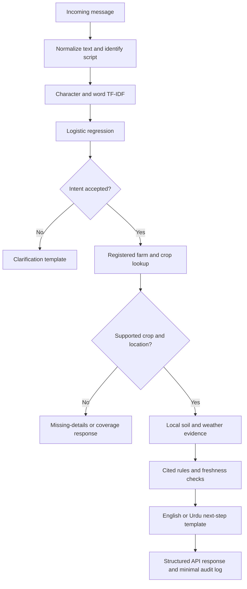

# Architecture and model design

## Runtime flow

Officer requests take a separate simulated-referral route. No message reaches a real officer.

## Model

The classifier is supervised logistic regression over a feature union of character TF-IDF (2–5 characters) and word TF-IDF (1–2 words). Training uses C=4, maximum 1,000 iterations and seed 42. Classes are planting, soil, weather, officer and unknown. Training features are fit only on training examples.

A validation-selected 0.40 confidence threshold and a recognizable-keyword gate control abstention. Probabilities are uncalibrated. The language router is a script heuristic, not a trained language detector. The model is trained from scratch; no LLM or pretrained transformer is fine-tuned.

The 140 AI-authored examples are split 80/20/40 by semantic family. Translations remain with their English counterparts. The held-out English model underperforms the keyword baseline. See the model card and evaluation report before interpreting results.

## Agricultural assessment

Soil and weather are retrieved evidence, not training labels. Assessment compares individual depth-specific pH estimates and quantiles against a provisional cited reference. It also checks reported standing water, dry soil and forecast validity. There is no overall suitability score or learned crop-success predictor. Other downloaded soil properties are retained for context without invented assessment thresholds.

## Components

| File | Responsibility |
|---|---|
| `farmsignal/api.py` | FastAPI endpoints, validation, service lifecycle |
| `farmsignal/service.py` | Request orchestration and response selection |
| `farmsignal/model.py` | Text normalization, keyword baseline, model loading and intent gating |
| `farmsignal/store.py` | Read-only SQLite lookup and native raster pixel mapping |
| `farmsignal/assessment.py` | Rules, missing evidence and forecast freshness |
| `farmsignal/templates.py` | Draft English/Urdu response text and language configuration |
| `farmsignal/adapters.py` | SMS adapter protocol and simulated referral |
| `scripts/acquire.py` | Soil/historical weather downloads and manifests |
| `scripts/forecast.py` | Bounded ECMWF GRIB downloads and point extraction |
| `scripts/preprocess.py` | Unit validation and atomic cache rebuild |
| `scripts/train.py` | Feature fitting and classifier training |
| `scripts/evaluate.py` | Baselines, held-out metrics and performance measurements |

## Operational separation

Online synchronization runs independently from training. Inference uses only local artifacts. A gateway restart is required after cache/model changes because metadata and models are loaded at startup. The demonstration API binds to localhost. It does not include production identity management, a registration service, durable message queues, signed releases or remote fleet management.
